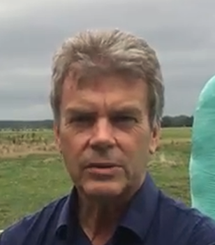

 

I'm Ane Visser, and I built Lukra. I'm an animal scientist by training and a software
developer by trade — and Lukra sits exactly where those two things meet: real nutritional
modelling, wrapped in serious optimisation. That combination is rarer than it sounds, and
it's the reason Lukra exists.

## Where the nutrition comes from

I studied animal science at Wageningen University, then came to New Zealand as a junior
scientist with LIC — my first close look at pasture-based dairy. After I returned to the
Netherlands, I spent years in nutritional modelling: first at the feed company BP Nutrition
(now Nutreco), building software for animal management and nutrition simulation, and later
across work with Nutreco, Purina Mills and, back in New Zealand, Massey University. Much of
that modelling was in pig nutrition rather than dairy — but the principles of partitioning
energy and nutrients across an animal's requirements carry across species, and they're the
same principles underneath Lukra.

## Where the optimisation comes from

Alongside the nutrition, I spent a long time building the other half of Lukra:
linear-programming systems for least-cost feed formulation. Software I wrote was used for
years by Purina Mills' field and commercial staff, and I worked with feed-formulation
software firms including Format International, Adifo and Dalex. I've also developed and
extended farm-mapping software in New Zealand, and spent time as a software test engineer —
work that sharpened my eye for software quality and broadened how I think about building
reliable systems. My interest in simulation started at university,
developing farm-systems models, and never really left.

## How Lukra started

After returning to New Zealand in 2005, visiting farms with consultants, something bothered
me. The emphasis was almost entirely on the feed wedge and making sure there was enough dry
matter in front of the cows — sometimes with a rough sense of energy, but no notion of
*optimisation*. It was a world away from what I had delivered for Purina Mills, where a
farmer received a least-cost ration built on proper modelling and optimisation.

Thinking it through for the New Zealand situation, and reading the scientific literature, I
reached the conclusion that became Lukra's core idea: for pasture-based dairy, **profit
maximisation is a better objective than least-cost formulation** — and least-cost is really
just a special case of profit maximisation that happens to hold under certain conditions,
such as a high milk price. Optimise for margin, and the least-cost ration is exactly what 
you get whenever cutting feed cost happens to be the most profitable move — and when it isn't, 
you get a more profitable plan instead. Optimising for profit can never do worse than 
optimising for cost alone, and often does better.

## Track record, honestly

An earlier version — then called DairyMax — was validated in work with Massey University and
selected for the [Sprout Agritech accelerator](https://www.stuff.co.nz/business/farming/75257400/new-business---dairy-feed-programme)
in 2015. Nutreco took it seriously enough to contract me to integrate it into their larger
nutritional system, and their PhD dairy-nutrition experts assessed the outputs as realistic.
That integration ended when the people who had championed it moved on — a shift in a large
company's priorities, not a verdict on the model.

What eventually stopped DairyMax wasn't the science; it was runway. Take-up in New Zealand
was slow — for most farms the existing way of working felt good enough — and without revenue
I couldn't carry it alone. I moved into software test automation, and when doing both proved
too much, focused on that for a period. Development paused after 2016.

I never stopped believing the approach was right. If anything ties the whole path together,
it's that I'm drawn to understanding how systems work — a cow's energy balance and a software
test framework are more alike than they look — so those automation years were never lost time.
They taught me tools and techniques I'd never used, and I've since used them to rebuild the
software from the ground up as Lukra. Revalidating the milk modelling against the NRC 2001 and
NASEM 2021 standards has left me more confident than ever that it holds up —
[the details are here](/blog/validating-lukra).

I've lived in farming areas for a large part of my life and have family who farm. Lukra is a
one-person project: I designed the model, wrote the software, and I'm the person you'll be
talking to in the beta.

